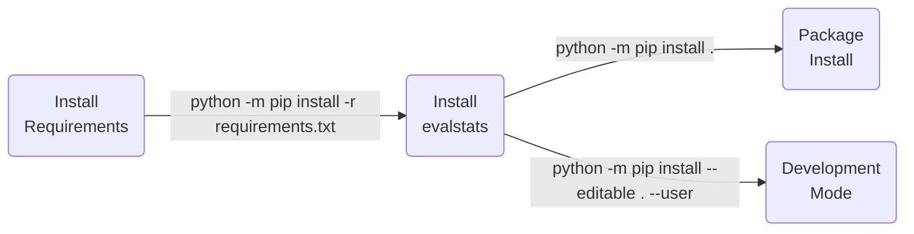

| **Authors**  | **Project** |  **Documentation** | **Build Status** | **Code Quality** | **Coverage** |
|:------------:|:-----------:|:------------------:|:----------------:|:----------------:|:------------:|
| [**N. Curti**](https://github.com/Nico-Curti) <br/> S&C25 student | **evalstats** | [](https://evalstats.readthedocs.io/en/latest/?badge=latest) | [](https://github.com/Nico-Curti/evalstats/actions/workflows/python.yml) | **TODO** | **TODO** |

[](https://github.com/Nico-Curti/evalstats/pulls)
[](https://github.com/Nico-Curti/evalstats/issues)

[](https://github.com/Nico-Curti/evalstats/stargazers)
[](https://github.com/Nico-Curti/evalstats/watchers)

<a href="https://github.com/UniboDIFABiophysics">
  <div class="image">
    
  </div>
</a>

# evalstats v0.0.1

## Example of project for Software&Computing course (aa 2024-25)

This is an example project developed during the Software&Computing course of the Applied Physics curriculum in collaboration with the students.

**Not intended for exam use.**

* [Overview](#overview)
* [Prerequisites](#prerequisites)
* [Installation](#installation)
* [Usage](#usage)
* [Testing](#testing)
* [Table of contents](#table-of-contents)
* [Contribution](#contribution)
* [References](#references)
* [Authors](#authors)
* [License](#license)
* [Acknowledgments](#acknowledgments)
* [Citation](#citation)

## Overview

Write an overview about the context and/or project that you have developed.
In the documentation you can use also fancy layouts, tables, and references to the code (like [this](https://github.com/Nico-Curti/evalstats/blob/main/README.md))

| :triangular_flag_on_post: Note |
|:-------------------------------|
| This is an important note for your documentation! |

## Prerequisites

The complete list of requirements for the `evalstats` package is reported in the [requirements.txt](https://github.com/Nico-Curti/evalstats/blob/main/requirements.txt)

## Installation

Python version supported : 

The `Python` installation for *developers* is executed using [`setup.py`](https://github.com/Nico-Curti/evalstats/blob/main/setup.py) script.



## Usage

You can use the `evalstats` library into your Python scripts or directly via command line.

### Command Line Interface

The `evalstats` package could be easily used via command line (after installing the library!) by simply calling the `evalstats` program.

The full list of available flags for the customization of the command line could be obtained by calling:

```bash
$ evalstats --help

usage: evalstats [-h] [--data DATA [DATA ...]] [--input INPUT] [--num-workers NUM_WORKERS] [--mean] [--std] [--min] [--max] [--count] [--sum] [--variance] [--all]
                 [--output OUTPUT] [--version]

Evaluate the main statistics of a given set of data.

optional arguments:
  -h, --help            show this help message and exit
  --data DATA [DATA ...], -d DATA [DATA ...]
                        The input data for which statistics will be computed. It should be a list of numbers separated by spaces. If not provided, an input file must be
                        specified using --input. Example: --data 1.0 2.5 3.6 4.2
  --input INPUT, -i INPUT
                        The input file from which to read the data. If not provided, data must be passed as a positional argument.
  --num-workers NUM_WORKERS, -n NUM_WORKERS
                        The number of worker threads to use for parallel computation. Default is 4.
  --mean, -mu           Compute the mean of the data.
  --std, -S             Compute the standard deviation of the data.
  --min, -m             Compute the minimum value of the data.
  --max, -M             Compute the maximum value of the data.
  --count, -c           Count the number of elements in the data.
  --sum, -s             Compute the sum of the data.
  --variance, -V        Compute the variance of the data.
  --all, -A             Compute all statistics (mean, std, min, max, count, sum, variance).
  --output OUTPUT, -o OUTPUT
                        The output file to save the computed statistics. If not provided, results will be printed to stdout.
  --version, -v         Get the current version installed
```

### Python script

A complete list of beginner-examples for the build of a custom `evalstats` pipeline could be found [here](https://github.com/Nico-Curti/evalstats/blob/main/examples) (**this link is broken but you can try to add your own examples!**).

For more advanced users, we suggest to take a look at the example [notebooks](https://github.com/Nico-Curti/evalstats/blob/main/notebooks), in which are reported more sophisticated applications and tests about the developed codes.

For sake of completeness, a simple `evalstats` pipeline could be obtained by the following snippet:

```python
from evalstats import EvalStats

# create a dummy buffer
data = [1, 2, 3, 4, 5, 6, 7, 8, 9, 10]
# create the object
es = EvalStats(data=data, num_workers=4)
print(es.all)
```

## Testing

A full set of testing functions is provided in the [test](https://github.com/Nico-Curti/evalstats/blob/main/test) directory (**this is another task on which you can work yourself**).
The tests aim to cover the full set of APIs proposed in the `evalstats` package.
If you want to contribute in the development of the library, please ensure that your new features will not affect the test results.
If you want to add new graphomic features, please add a new test branch which cover as much as possible your codes.

The tests are performed using the [`pytest`](https://github.com/pytest-dev/pytest/) Python package.
You can run the full list of tests with:

```bash
python -m pytest ./test/ --cov=evalstats --cov-config=.coveragerc
```

in the project root directory.

The continuous integration using `github-actions` tests each function in every commit, thus pay attention to the status badges before use this package or use the latest stable version available.

## Table of contents

Description of the folders related to the `Python` version.

| **Directory**                                                                        |  **Description**                                                             |
|:-------------------------------------------------------------------------------------|:-----------------------------------------------------------------------------|
| [notebook](https://github.com/Nico-Curti/evalstats/blob/main/notebooks) | `Jupyter` notebook with some examples of code optimization.             |
| [evalstats](https://github.com/Nico-Curti/evalstats/blob/main/evalstats)          | List of `Python` scripts for `evalstats` analysis. |

## Contribution

| :triangular_flag_on_post: Note |
|:-------------------------------|
| The following files are missing an they must be inserted/updated according to your needs/projects |

Any contribution is more than welcome :heart:. Just fill an [issue](https://github.com/Nico-Curti/evalstats/blob/main/.github/ISSUE_TEMPLATE/ISSUE_TEMPLATE.md) or a [pull request](https://github.com/Nico-Curti/evalstats/blob/main/.github/PULL_REQUEST_TEMPLATE/PULL_REQUEST_TEMPLATE.md) and we will check ASAP!

See [here](https://github.com/Nico-Curti/evalstats/blob/main/.github/CONTRIBUTING.md) for further informations about how to contribute with this project.

## References

<blockquote>1- Author et al, "Title", Journal, Year </blockquote>

## Authors

*  [](https://github.com/Nico-Curti) [](https://www.unibo.it/sitoweb/nico.curti2) **Nico Curti**

* **All the students of the Software&Computing course (aa. 2024-25)**

See also the list of [contributors](https://github.com/Nico-Curti/evalstats/contributors) [](https://github.com/Nico-Curti/evalstats/graphs/contributors/) who participated in this project.

## License

The `evalstats` package is licensed under the MIT [License](https://github.com/Nico-Curti/evalstats/blob/main/LICENSE).

## Acknowledgments

Thanks goes to all contributors of this project.

## Citation

If you have found `evalstats` helpful in your research, please consider citing the original repository

```BibTeX
@misc{evalstats,
  author = {Curti, Nico and Software&Computing students},
  title = {evalstats - Extraction of the main statistics from a series of data},
  year = {2025},
  publisher = {GitHub},
  howpublished = {\url{https://github.com/Nico-Curti/evalstats}}
}
```
